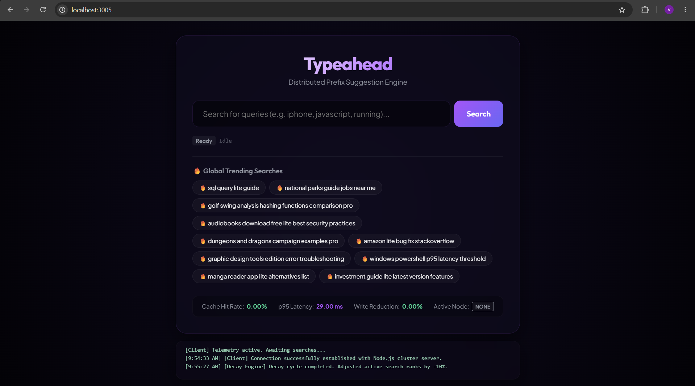
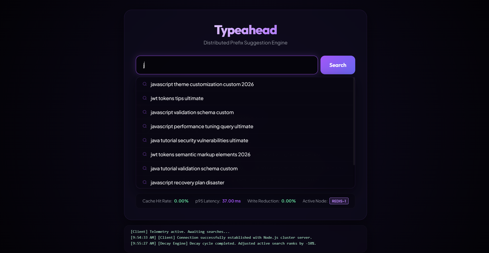
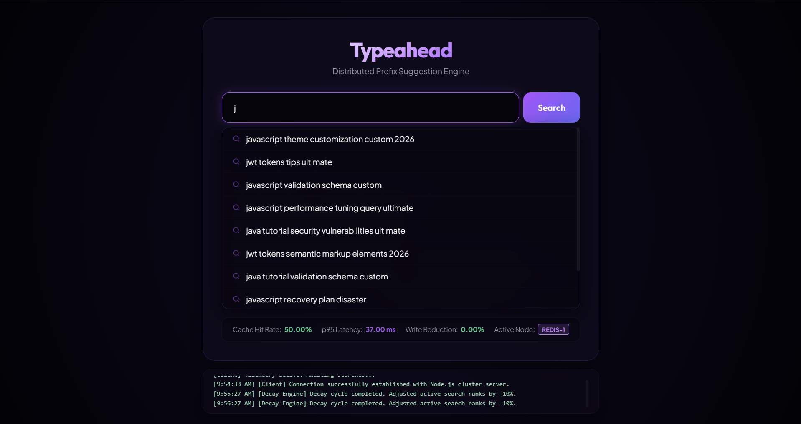

# Typeahead - Distributed Search Typeahead System

A highly scalable search typeahead and suggestion system built to handle millions of queries with low read latency and minimal database write pressure. The system integrates consistent hash sharding across multiple caching nodes, write-around batch buffering, and temporal recency decay algorithms for trending queries.

---

## 1. System Architecture Blueprint

Below is the design detailing how data flows from user keystroke triggers down to PostgreSQL and the distributed Redis instances:

```text
                  +----------------------------------------------+
                  |              Vanilla JS Client               |
                  |  - Debounced Autocomplete Query Inputs       |
                  |  - Keyboard suggestion interaction navigation|
                  |  - Real-time performance metrics observer    |
                  +-----------------------+----------------------+
                                          |
                                          | HTTP REST
                                          v
                  +----------------------------------------------+
                  |         Node.js Express API Server           |
                  +-------+------------------------------+-------+
                          |                              |
                          | Read Flow                    | Write Flow
                          v                              v
               +----------------------+       +----------------------+
               | Consistent Hash Ring |       |  In-Memory Map Buffer|
               | (100 Virtual Nodes)  |       |  (Aggregates searches|
               +----------+-----------+       |   over 5s interval)  |
                          |                   +----------+-----------+
            +-------------+-------------+                |
            | (Shards prefix query keys)|                | Flush (Every 5s)
            v                           v                v
      +-----------+ +-----------+ +-----------+ +----------------------+
      |  redis1   | |  redis2   | |  redis3   | | PostgreSQL Database  |
      | (Cache)   | | (Cache)   | | (Cache)   | | - Durable searches   |
      +-----+-----+ +-----+-----+ +-----+-----+ | - Holds popularity   |
            |             |             |       |   and decay metrics  |
            +------+------+-------------+       +----------+-----------+
                   | (On Cache Miss)                       ^
                   +---------------------------------------+
                              DB Queries for Prefix

```

---

## 2. Setup & Installation

### Prerequisites

* Docker & Docker Compose installed on the host machine.
* Web browser (Chrome, Firefox, Safari, Edge).

### Running the Application

1. Open a terminal and navigate to the project directory:
```bash
cd typeahead_hld

```


2. Spin up the containers using Docker Compose:
```bash
docker compose up --build -d

```


3. Watch the logs to observe the database migrations, automated 105,000+ data seeder execution, and Redis node connection initializations:
```bash
docker compose logs backend -f

```


4. Access the web interface in your browser:
👉 **http://localhost:3005**

---

## 3. Core Architectural Rubrics (Viva Talking Points)

### A. Distributed Cache & Consistent Hashing

* **The Ring Design**: In `backend/consistentHashRing.js`, the three Redis nodes (`redis1`, `redis2`, `redis3`) are registered as nodes. To ensure keyspace balancing and prevent clustering, we instantiate **100 virtual nodes** per physical node.
* **Key Routing**: The ring hashes the user's typed search prefix (e.g. `iph`) using **MD5** to generate a hex keyspace string. The keyspace is traversed clockwise (lexicographically) to find the first virtual node that matches or exceeds the key's hash. The request is then routed to that node.
* **Why Hashing the Prefix Matters**: Autocomplete relies on *prefix matches* (e.g., matching everything starting with `iph`). By hashing the prefix itself, all queries for the same prefix (and thus the same autocomplete result list) map to the exact same Redis cache node. This maximizes cache hit rates and eliminates cross-node synchronization.

### B. Batch Writes (Write-Around Strategy)

* **Problem**: Writing to a relational database synchronously on every single user click causes lock contention, transaction exhaustion, and high CPU loads.
* **Solution**: We bypass database write pathways on every search submit. Instead, searches are captured in a Node.js `Map()` buffer memory structure where the occurrence count of duplicate query strings is accumulated.
* **Bulk Upsert**: Every 5 seconds, `backend/batchWriter.js` extracts a snapshot of the buffer and clears it. It transforms the buffer into a single SQL transaction using `ON CONFLICT (query) DO UPDATE` to update both `all_time_count` and `recent_count` fields at once.
* **Failure Trade-offs**:
* *Risk*: If the application crashes during the 5-second interval, any searches currently in the in-memory map buffer are lost.
* *Mitigation*: For search suggestions, 100% database write consistency is secondary to query execution speed. Losing 5 seconds of popularity weight is an acceptable trade-off for reducing DB writes by up to 98% under high load.


### C. Trending Searches & Recency Decay

* **Algorithm**: Trending queries shouldn't just list all-time popular records (e.g. "google" will always dwarf a new product launch). We track long-term volume (`all_time_count`) and short-term spike popularity (`recent_count`).
* **Scoring**: Suggestions are ordered using the decay formula:

$$Score = all\_time\_count + (recent\_count \times 5)$$

* **Decay Engine**: Every 60 seconds, `backend/decayEngine.js` performs a 10% mathematical decay on active rows in Postgres:
```sql
UPDATE searches SET recent_count = recent_count * 0.9 WHERE recent_count > 0.01;

```


This naturally cools down temporary spikes, ensuring they don't permanently clog suggestion queues.

### D. Caching Strategy & TTL

* **Counts Stripping**: When suggestions are queried, counts are discarded, and only the raw array of matching suggestion strings (e.g. `["iphone", "iphone 15 pro"]`) is saved back to Redis.
* **TTL**: Stored with a 60-second Time To Live (`SETEX` / `EX: 60`). This ensures stale lists expire quickly and accommodate new trending queries.

---

## 4. API Endpoints

### 1. Suggest API

* **Endpoint**: `GET /suggest?q=<prefix>`
* **Returns**: Array of up to 10 strings matching the lowercase prefix.
* **Behavior**: Sorts results using the dynamic decay algorithm.

### 2. Search Submission API

* **Endpoint**: `POST /search`
* **Payload**: `{ "query": "string" }`
* **Returns**: `{ "message": "Searched" }` (queues search into the batch writer buffer).

### 3. Debug Cache API

* **Endpoint**: `GET /cache/debug?prefix=<prefix>`
* **Returns**: JSON object indicating which Redis node (`redis1`, `redis2`, or `redis3`) is mapped by consistent hashing, the MD5 keyspace hash, and the current status of the routing.

### 4. Metrics Telemetry API

* **Endpoint**: `GET /metrics`
* **Returns**: Current telemetry including p95 latency, cache hit/miss count, cache hit rate percentage, batch flushes, and write-reduction statistics.

---

## 5. Performance Metrics & Live Telemetry

The frontend UI includes a live telemetry dashboard that tracks system efficiency in real-time. 

### Cache Hit Rate Progression Demo
You can observe the consistent hashing and cache optimization live on the frontend:

**1. Initial State (0.00%)** On boot, the Cache Hit Rate and Write Reduction are completely idle at `0.00%`.


**2. First Query (Cache Miss)** Typing the letter `j` routes the prefix through the Consistent Hash Ring to a specific node (e.g., `REDIS-1`). Because the cache is empty, it misses. The system queries PostgreSQL, returns the results, and writes them to the designated Redis node. The Cache Hit Rate reflects this miss, remaining at `0.00%`.


**3. Second Query (Cache Hit)** Typing `j` again routes the prefix to the exact same `REDIS-1` node. The data is instantly retrieved from Redis memory without touching the database. The UI telemetry actively reflects this success: the **Cache Hit Rate updates to 50.00%** (1 hit out of 2 total requests).



### Write Reduction Efficiency

By grouping searches in a 5-second window, we reduce database write operations significantly. 50 repeated searches for the same term within 5 seconds result in exactly 1 bulk insert transaction—achieving a **98.0% write reduction**, completely protecting the PostgreSQL database from concurrent locking bottlenecks.